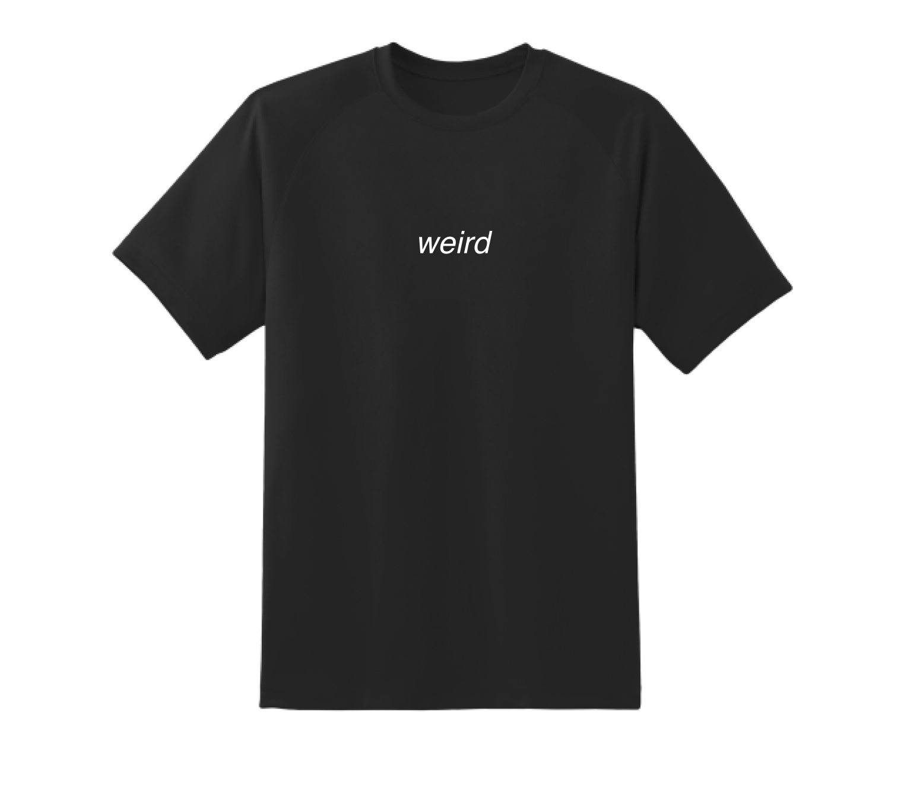

# it is what it is not 

no one  
no thing   
no idea  
**can be interpreted with a single word to its full extent without an understanding behind the mastermind of its own.** 

every one  
every thing  
every idea  
**is created with a cause in mind, illuminated from an experience and is subjective to change.** 

share everything  
share nothing  
share  
**to understand all of the above.**

 
 
 
 
 
 
 
 

Blend of chaotic thoughts and reasoned ideas.

Unconstraint and spontaneous visualization of internal monologues.

Expression of your impression.

 
 
 
 
 
 
 
 

 
 
 
 
 
 
 
 

**How do you not communicate a paradox? - we all say and yet only a fraction of us are **
 
 
 
 

