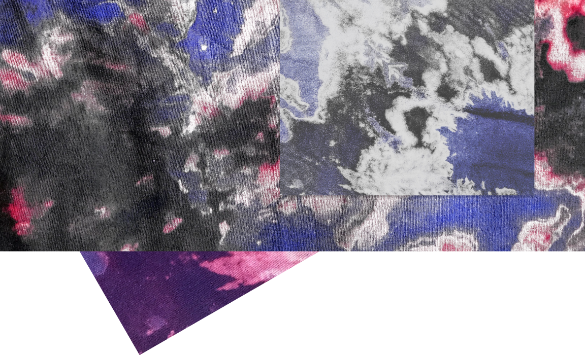

# it is what it is not 

why? what? where? when? who? how?  

**no adjective is:**
no one 
no thing  
no perspective
**can be interpreted with a single word to its full extent without an understanding behind the mastermind of its own.** 

**we believe in: **
every one
every thing 
every perspective
**is created with a cause in mind, illuminated from an experience and is subjective to change.** 

**we share:**
ideas
memories
experiences 
**to understand all of the above.**

blend of chaotic thoughts and reasoned ideas - creating and inspiring  

unconstraint and spontaneous visualization of internal monologues

**How do you not communicate a paradox? - we all say and yet only a fraction of us are **

no one cannot be described with a single word, yet everyone is. no article of clothing can define or expound your true identity, outside surrounding is no more than a complement of your inner self. experience the perspectives though inception of inspirations. 

no idea can be interpreted with a single word to the full extent, no intent can be grasped without an understanding behind the mastermind of your own.

---

